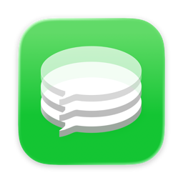
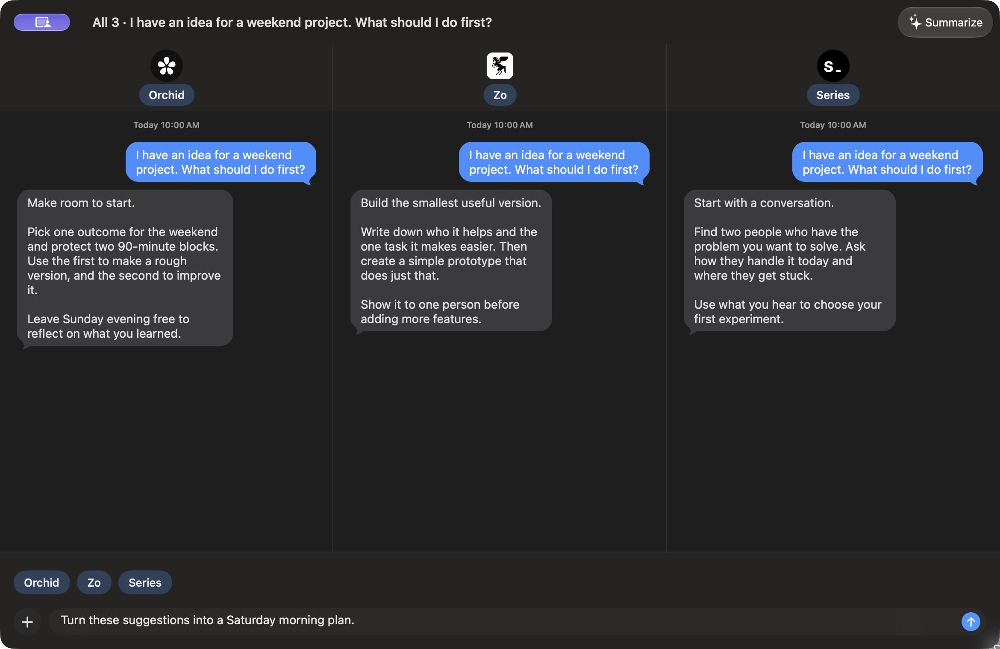
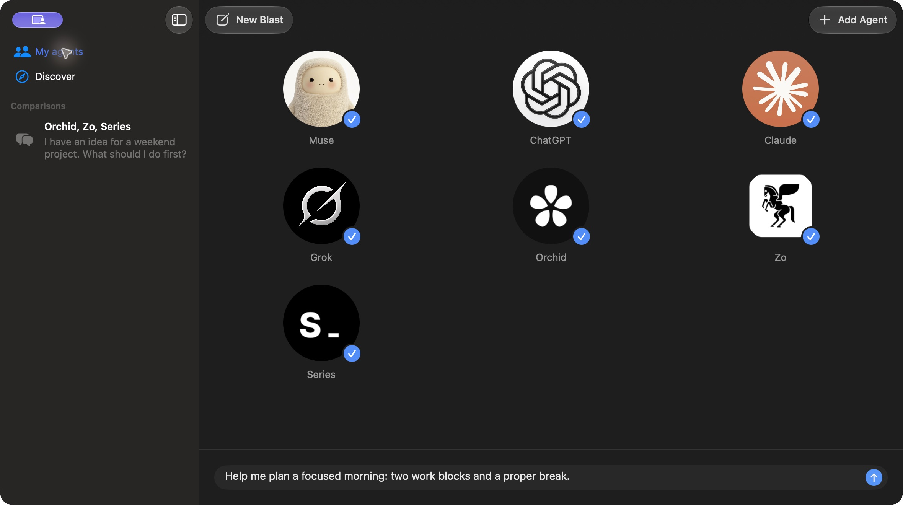
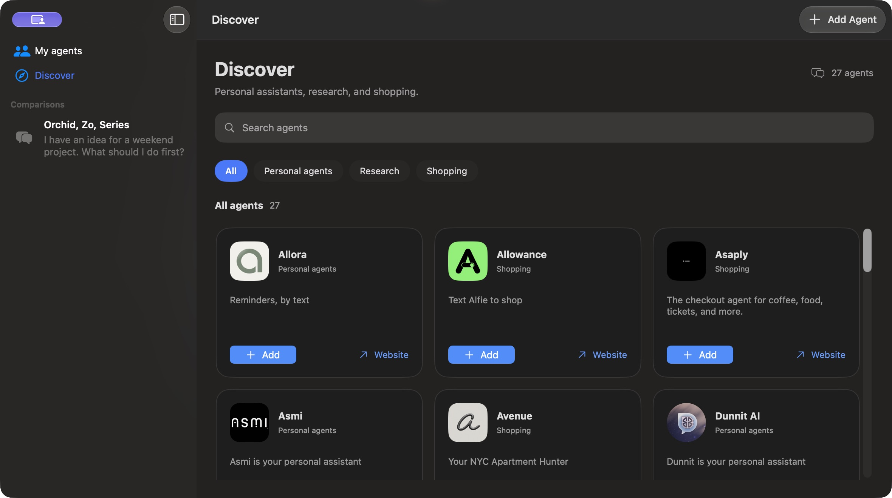

<p align="center">
  
</p>

<h1 align="center">msgblast</h1>
<p align="center"><strong>Ask once. Compare the answers.</strong></p>
<p align="center">Your AI agents, together in one Mac app.</p>
<p align="center"><a href="https://updates.msgblast.app/latest.zip"><strong>Download for Mac</strong></a> · macOS Sequoia 15 or later</p>



Send one prompt to multiple agents, compare their replies, and follow up without losing the thread. Use Muse, ChatGPT, Claude, and Grok alongside your Messages agents. Reopen saved comparisons whenever you need them.

*Actual app interface with an illustrative sample conversation; replies shown are sample copy.*

## Pick your agents

Choose who gets your prompt. Web agents use your existing accounts; Messages agents use your one-to-one iMessage conversations. Photos and files work with Messages agents.



## Find your next agent

Browse **Discover** for agents that help with personal assistance, research, and shopping.



## Get started

1. [Download msgblast](https://updates.msgblast.app/latest.zip), unzip it, and drag **msgblast.app** into **Applications**.
2. Open the app and select your agents. Sign in to web agents inside msgblast.
3. Write a prompt and send it. Compare the replies, then ask a follow-up.

For Messages agents, allow Messages history, Contacts, and Messages Automation when prompted. Start a one-to-one conversation in Messages before adding an agent.

<details>
<summary>Installation and Messages permissions</summary>

If macOS blocks the first launch, open **System Settings → Privacy & Security → Open Anyway** after trying to open the app. [Apple’s first-launch instructions](https://support.apple.com/en-us/102445#openanyway).

For Messages history, click **Open Settings** in the app, add **msgblast.app** under **Privacy & Security → Full Disk Access**, and enable it. Quit and reopen msgblast, then click **Check again** if needed.

Allow **Contacts** when asked. On the first Messages send, allow msgblast to control **Messages**. If access was previously declined, enable msgblast under **Privacy & Security → Contacts** and **Automation → Messages**.

</details>

Check for updates from **msgblast → Check for Updates**. For comparison reports, click **Summarize**; see [report setup](docs/personal-agent-reports.md).

## Build it yourself

Install **Xcode 16.4 or later**, then clone this repository and build the app:

```sh
git clone https://github.com/mgalpert/msgblast.git
cd msgblast
xcodebuild -project msgblast.xcodeproj -scheme msgblast \
  -derivedDataPath build/from-source -destination 'platform=macOS' build
open build/from-source/Build/Products/Debug/msgblast.app
```

You can also open **msgblast.xcodeproj** in Xcode, select the **msgblast** scheme, and click **Run**.

## License

Copyright (C) 2026 Michael Galpert and contributors.

Except where separately licensed or attributed, msgblast is licensed under the
[GNU General Public License, version 3 only](LICENSE) (`GPL-3.0-only`). You may
use, modify, and redistribute it, including commercially, under those terms.
Distributed modified versions must remain under GPLv3 and include the
corresponding source as required by the license. The software comes without
any warranty.

Third-party dependencies, service icons, logos, and other attributed assets
retain their respective licenses and rights; this license does not relicense
third-party material or grant trademark rights.
