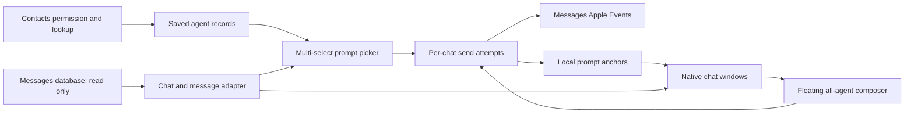

# Native Agent iMessage Comparison - Plan

Historical initial plan from September 30, 2026. Later recorded product decisions
and implementations expanded this scope. For current contributor setup and the
present codebase, use [the documentation index](docs/README.md),
[Architecture](docs/architecture.md), and [AGENTS.md](AGENTS.md). Preserve the
requirements and verification record below as historical context.

## Goal Capsule

**Objective:** A Mac user can send one prompt to several agents through separate existing iMessage conversations, compare their live replies side by side, and continue either with everyone or with one agent without copying messages or creating a group chat.

**Means:** Build a local native Mac app with linked, independently movable conversation windows and a separate send-to-all composer (KTD1, KTD2).

---

## Product Contract

### Summary

The app saves a set of agent contacts, lets the user select any number of them for a prompt, sends one identical message into each agent's existing one-to-one iMessage chat, and opens linked conversation windows starting at those outgoing messages. Each agent window has a direct reply field. A separate draggable composer sends to every agent in the linked prompt. Saved prompt anchors make earlier comparisons easy to reopen.

### Problem Frame

The user's primary messaging channel for agents is iMessage. Today, asking multiple agents the same question requires repeated composition and manual switching between chats to compare answers. Apple's Messages app has individual conversations but no shared comparison workspace for them.

### Actors and flows

- A1. Mac user: installs the app, chooses existing agent contacts, creates comparisons, and sends follow-ups.
- A2. Agent contact: receives and replies in an ordinary one-to-one iMessage chat; no special agent integration is required in v1.

- F1. **Onboard:** grant needed local permissions, search Contacts, save agent name, number, avatar or color placeholder, and match each agent to an existing one-to-one iMessage chat.
- F2. **Start comparison:** select any number of saved agents from a multi-select list, write one prompt, inspect the destinations, and send separate one-to-one messages.
- F3. **Compare and continue:** see each chat from its prompt anchor onward; send the same follow-up through the floating composer or a private follow-up through an agent window.
- F4. **Revisit:** reopen a saved prompt; each agent's ordinary message range ends at that agent's next comparison start, if one exists, while later replies explicitly tied to the older prompt remain in its saved view. Other agents continue updating normally.

### Requirements

#### Agent setup and selection

- R1. V1 runs on macOS and uses the user's existing iMessage account and one-to-one conversations.
- R2. Onboarding lets the user search Contacts and save an agent's display name, number, and contact avatar; agents without an avatar receive a plain color placeholder.
- R3. V1 accepts only contacts that can be matched to an existing one-to-one iMessage conversation; it does not start a first conversation with a new contact.
- R4. When a contact has several existing one-to-one conversations, the app chooses the most recently active one automatically and shows the chosen destination before sending.
- R5. The prompt picker supports any number of saved agents through a clear multi-select list; it does not hardcode the example agents or their phone numbers for other users.

#### Messaging and comparison

- R6. Sending a shared prompt creates one separate outgoing message per selected agent and never creates a group conversation.
- R7. Every recipient gets the same prompt text, and the app shows per-agent submission or failure status so a failed recipient alone can be retried without resending to successful recipients.
- R8. Each agent window shows messages from that agent's outgoing prompt anchor onward and updates when a message arrives or is sent through Apple's Messages app.
- R9. Each agent window has its own input for a message addressed only to that agent.
- R10. The floating composer is an independently draggable window that addresses all agents belonging to its saved prompt; it has no per-agent target selector.
- R11. The app saves prompt start points locally and lets the user reopen past comparisons without manually ending conversations.
- R12. When an agent joins a newer comparison, that agent's ordinary messages stop appearing in the older view before the newer prompt, but later inline replies tied to the older prompt remain there; other agents in the older comparison keep updating.
- R13. A send-to-all follow-up from an older comparison must visibly reference its original prompt for an agent who has since joined another comparison. The preferred form is a genuine iMessage inline reply; v1 implementation must validate that path before claiming it works.

#### Windows and interaction

- R14. Conversation views are separate native Mac windows that start tiled as tall columns in one horizontal row, without a second row or overlapping layout.
- R15. Each conversation window can be dragged and viewed independently while remaining visibly associated with its saved prompt and floating composer.
- R16. When selected agents exceed the available screen width, the app keeps a horizontal order and offers navigation to offscreen agent windows without shrinking conversations below a readable width.
- R17. The send-to-all composer clearly names its prompt and recipient count before sending; each agent window clearly names its private destination.

### Key decisions

- **Separate chats and group composer:** Each agent window owns private replies; the floating composer sends to the complete prompt set. Governs R6, R9, R10. (session-settled: user-directed — chosen over one composer with an All/Agent selector: a dedicated input in each tile makes private replies clear.)
- **Open-ended saved ranges:** Save starts; do not require a manual end or use an inactivity timer. An agent's next prompt bounds ordinary messages in the previous view, while replies tied to the old prompt remain visible. Governs R11, R12. (session-settled: user-directed — chosen over closing the whole comparison when one agent moves on: the remaining agents may still reply.)
- **Horizontal native windows:** Use separate linked windows in a single row. Governs R14–R16. (session-settled: user-directed — chosen over a docked comparison canvas or vertical stacking: chats must remain individually draggable.)
- **Existing chats and automatic routing:** Use an existing one-to-one chat, automatically choosing the most recent when a contact has several. Governs R3, R4. (session-settled: user-directed — chosen over making the user pick an address: existing Messages activity should guide routing.)

### Acceptance examples

- AE1. **Covers R6–R8:** Select Agents A and B, send “Compare these options,” and see one outgoing copy in each existing one-to-one chat; a later reply from B in Messages appears in B's comparison window.
- AE2. **Covers R9–R10:** Type in A's window and only A receives it; type in the floating composer and every agent in that saved prompt receives a separate copy.
- AE3. **Covers R11–R13:** Start a later comparison containing A while B remains in the first. Reopening the first shows A's ordinary messages only up to A's newer prompt, plus any later inline replies tied to the first prompt; B keeps receiving new messages there. A follow-up to the old set references its original prompt for A.
- AE4. **Covers R14–R16:** Select more agents than fit across one display. Their windows remain readable columns reached horizontally; dragging one away does not turn the chats into a group or break its prompt association.
- AE5. **Covers R4, R7:** A contact has two existing conversations; the app selects the newest and displays its destination. If only B's send fails, retrying sends only to B.

### Scope boundaries

**V1 includes:** local Mac app, Contacts-backed agent setup, existing one-to-one iMessage chats, shared prompt and follow-ups, live read views, saved starts, native windows, and permission/error handling.

**Deferred:** v1.2 CLI commands that send to agents; v2 agent-generated summaries or comparisons of responses. New chats to never-messaged contacts, group chats, attachments, reactions, edit/unsend, and non-Mac clients are outside v1.

### Success criteria

- The user can complete F1–F4 without copying a message between agent chats.
- A three-agent integration fixture produces three distinct one-to-one send operations and no group operation; any live multi-recipient check uses only separately authorized test destinations.
- Replies made or received in Messages appear in the correct saved comparison after refresh, and live refresh works during normal app use.
- No test send is duplicated after a partial failure or app restart.
- Native inline-reply capability is either proven end to end for R13 or explicitly brought back as a product decision before v1 is declared complete.

---

## Planning Contract

### Existing environment and constraints

This workspace is empty and is not yet a Git repository; all application and test paths below are proposed additions. The machine has Xcode 27 and Swift 6.4 on macOS 27.2. The installed Messages scripting dictionary exposes `send` of text or file to a participant or chat, but no reply-target parameter. This session's Computer Use access to Messages and read access to the local Messages database were denied, so no live send, inline-reply linkage, or database schema has been verified here.

Apple documents inline replies in the Messages UI, but its public Messages framework describes iMessage app extensions rather than an arbitrary Mac app's access to existing chats. Apple requires the person to grant Full Disk Access manually for protected files. Contacts access and Apple Events automation each require their own consent. These constraints make a direct Mac integration proof the first execution gate.

### Key technical decisions

- KTD1. Use SwiftUI for views with AppKit-owned `NSWindow` instances for agent columns and a separate small `NSPanel` for the floating composer. The windows share a saved comparison identifier and can move independently. Implements R10, R14–R17. (session-settled: user-directed — chosen over a single docked canvas: each chat must be an individually draggable native window.)
- KTD2. Keep an app-owned local store for agent selections, prompt anchors, per-agent range bounds, send attempts, and window positions; do not copy full message history into it. Read Messages' store through a read-only adapter after permission is granted. Implements R2–R4, R7–R8, R11–R12.
- KTD3. Bind a saved agent to the most recently active eligible one-to-one chat, using that chat's stable identity and handle rather than assuming the contact's last sender number is the send destination. Revalidate before a shared send and show the destination. Implements R3–R4. (session-settled: user-directed — chosen over manual address selection: the user wants routing based on existing activity.)
- KTD4. Use the installed Messages Apple Events `send` command for ordinary one-to-one text, with a separate send attempt and receipt per chat. Treat a successful automation call as submitted to Messages, not proof of delivery. Never write to `chat.db`. Implements R6–R7, R9–R10.
- KTD5. Represent each prompt as one logical comparison with one outgoing anchor per recipient. A newer anchor in the same chat bounds ordinary messages in that recipient's older view; explicit inline-reply relationships can still attach later messages to the older prompt. No timer closes another recipient's range. Implements R8, R11–R13. (session-settled: user-directed — chosen over freezing every recipient together: agents can finish at different times.)
- KTD6. Test genuine inline replies with the authorized single test recipient before committing to an implementation path. If no supported send API exists, evaluate a narrow Accessibility workflow that selects the exact original message and invokes Messages' Reply action; never synthesize reply records by modifying Messages' database. A failure to prove a reliable path blocks R13 rather than silently substituting quoted text. Implements R13.
- KTD7. Tile at readable width in one horizontal row. When the row exceeds the display, preserve the order in an app-controlled horizontal window navigator that brings a selected native window into view; user drags override the suggested placement. Implements R14–R16.

### Directional data flow



### Directional comparison lifecycle

```text
draft -> sending -> active -> saved/open-ended
                    |                 |
                    |                 +-> per-agent ordinary range bounded by next prompt
                    |                 +-> later inline replies to old prompt remain associated
                    +-> partial failure: successful sends remain anchored; retry failed chats only
```

### Assumptions and risks

- **Permissions:** The user will need to grant Contacts, Automation, and likely Full Disk Access. Genuine inline replies via Accessibility would require another explicit OS permission. The app must show which capability is unavailable and how to enable it, without claiming it can grant access itself.
- **Private schema:** Apple's Messages database is not a public app data API. Its path, schema, and behavior may change; isolate queries behind an adapter, detect unsupported layouts, and never mutate it.
- **Inline replies:** R13 is a feasibility gate. The separate Codex test requested by the user has not yet returned. A reliable Accessibility path may depend on Messages UI details and may bring Messages to the foreground.
- **Large sets:** A physical display cannot show unlimited native windows at readable width simultaneously. R16 assumes an app-controlled horizontal navigator for the offscreen columns; the windows remain individually movable.
- **Destination identity:** Contacts may merge multiple handles while Messages has separate chats. The app uses an exact existing chat and shows its resolved destination; it must not infer a universal “reply to latest sender” rule.
- **Distribution:** V1 is designed for local/personal Mac use. Signing, notarization, and Mac App Store eligibility remain packaging decisions after the integration proof; the plan does not assume App Store access to protected Messages data.

### Sources

- [Apple: send a message on Mac](https://support.apple.com/en-ph/guide/messages/icht35827/26.0/mac/27) — existing conversation versus choosing a recipient address; inline Reply UI.
- [Apple: inline reply on Mac](https://support.apple.com/en-mide/guide/messages/icht4a6d29fb/mac) — the user-visible target behavior.
- [Apple: Messages framework](https://developer.apple.com/documentation/messages) — public framework scope.
- [Apple: protected file access](https://developer.apple.com/documentation/security/accessing-files-from-the-macos-app-sandbox) — user-controlled Full Disk Access.
- [Apple: Contacts framework](https://developer.apple.com/documentation/contacts) — permission and contact lookup.
- [Apple: Accessibility UI control](https://developer.apple.com/documentation/applicationservices/axuielement_h) — possible UI automation surface for inline replies.

---

## Implementation Units

### U1. Establish the Mac app and permission shell

**Goal:** Create the native project with explicit capability states and a local-only data boundary.

**Requirements:** R1, R2, R8.

**Files:** `msgblast.xcodeproj`, `msgblast/App/`, `msgblast/Permissions/`, `msgblastTests/PermissionStateTests.swift`.

**Approach:** Build the SwiftUI app entry, AppKit window coordinator, Contacts and Automation permission descriptions, Full Disk Access guidance, and capability-specific blocked states. Keep permission requests tied to the feature that needs them.

**Test scenarios:** Fresh install shows an understandable setup path; denied Contacts blocks agent search but does not crash; denied Messages database access blocks chat views with a recovery action; denied Automation blocks sending and preserves the draft.

**Verification:** Build in Xcode and exercise grant/deny states on a test macOS account or controlled fixture.

### U2. Prove Messages read, send, and inline-reply capabilities

**Goal:** Validate the external integration before the product depends on it.

**Requirements:** R3, R6–R8, R13.

**Files:** `msgblast/Messages/MessageStoreProbe.swift`, `msgblast/Messages/MessagesAutomationProbe.swift`, `msgblastTests/MessagesProbeTests.swift`, `docs/integration-findings.md`.

**Approach:** With permission, inspect only schema and authorized test records; identify chat identity, outgoing anchor, incoming updates, and reply relationship. Send ordinary text to the authorized test destination. Test Messages' inline Reply UI and whether the app can target the exact prompt through Accessibility. Record observed OS version, permissions, and failures. Keep probes isolated from production adapters.

**Test scenarios:** Exact test recipient is resolved as one-to-one; ordinary send creates one outgoing record; UI inline reply links to the intended original message; an unavailable permission gives a clear result; a stale or ambiguous target aborts without sending.

**Verification:** Review the test transcript and `docs/integration-findings.md`. Do not start paid agent jobs solely for evidence. If inline reply cannot be proven, stop the R13 path and bring the product tradeoff to the user before claiming v1 completion.

### U3. Add agents from Contacts and bind existing chats

**Goal:** Give each user a local agent list with correct chat routing.

**Requirements:** R2–R5.

**Files:** `msgblast/Agents/`, `msgblast/Contacts/`, `msgblast/Messages/ChatResolver.swift`, `msgblastTests/AgentSetupTests.swift`.

**Approach:** Search Contacts, store the selected contact identity and presentation fields, render a color avatar when needed, and match only existing one-to-one iMessage chats. Choose the most recently active eligible chat when several exist, but surface its destination in the picker.

**Test scenarios:** Contact with photo; contact without photo; no existing one-to-one chat; multiple existing chats with distinct activity times; group chat only; contact whose stored number changed since setup.

**Verification:** Unit fixtures for routing and a manual check against controlled Contacts and Messages entries.

### U4. Build prompt sending and local anchors

**Goal:** Send one prompt to any selected set and save a durable start for each recipient.

**Requirements:** R5–R7, R11–R12.

**Files:** `msgblast/Comparisons/`, `msgblast/Messages/MessageSender.swift`, `msgblast/Storage/`, `msgblastTests/PromptSendTests.swift`, `msgblastTests/ComparisonRangeTests.swift`.

**Approach:** Persist a draft and intended recipients before sending. Issue separate one-to-one sends, reconcile the resulting outgoing records to stable anchors, and record per-recipient state. Retry only failures. Bound ordinary messages by the next prompt anchor in that chat while retaining later replies explicitly tied to the older anchor.

**Test scenarios:** Two and many recipients; one recipient fails after others succeed; app restarts during send; retry does not duplicate successful recipients; later comparison reuses A while B continues in the first; A's later inline reply appears in the first view while an unrelated ordinary message does not; same-text messages at close timestamps still resolve to distinct anchors.

**Verification:** Automated send-target tests plus an authorized controlled Messages send. Any live multi-recipient check uses only separately authorized test destinations.

### U5. Render live comparison windows

**Goal:** Show bounded, live transcripts in independently movable, visibly linked windows.

**Requirements:** R8, R11–R12, R14–R16.

**Files:** `msgblast/Windows/`, `msgblast/Comparisons/ComparisonView.swift`, `msgblast/Messages/MessageReader.swift`, `msgblastTests/ComparisonWindowTests.swift`.

**Approach:** Read message ranges through the adapter, refresh as Messages changes, and display per-agent windows with shared comparison identity. Suggest a horizontal tile layout; preserve user-moved positions and provide a navigator when some columns are offscreen.

**Test scenarios:** New reply appears from Messages; outgoing message made in Messages appears; switching to a saved comparison respects each agent's ordinary bound and later inline replies; dragging one window does not move another; six agents remain reachable on a narrow display; missing/deleted anchor shows a recoverable state.

**Verification:** UI tests at normal and narrow desktop widths, plus manual drag and live-update checks.

### U6. Add private and all-agent composers

**Goal:** Make sending scope unmistakable in the two input surfaces.

**Requirements:** R9–R10, R13, R17.

**Files:** `msgblast/Windows/FloatingComposer.swift`, `msgblast/Comparisons/AgentComposer.swift`, `msgblast/Messages/ReplySender.swift`, `msgblastTests/ComposerRoutingTests.swift`.

**Approach:** Each agent window sends only to its bound chat. The separate draggable panel sends to every member of its prompt and shows the set before send. For members whose old range has ended, use the proven R13 context path; prevent send if the exact original prompt cannot be targeted safely.

**Test scenarios:** Private reply reaches one agent; all-agent send produces separate copies for every member; moving the floating panel does not change its target set; older comparison with moved A still references the original prompt; unavailable inline-reply capability blocks the ambiguous send with an explanation.

**Verification:** Routing tests plus manual end-to-end checks in the authorized test conversation.

### U7. Complete onboarding, recovery, and evidence

**Goal:** Make the feature usable on a clean Mac and document its actual behavior.

**Requirements:** R1–R17.

**Files:** `msgblast/Onboarding/`, `msgblastTests/EndToEndFlowTests.swift`, `README.md`, `docs/integration-findings.md`.

**Approach:** Finish permission education, empty states, destination preview, saved comparison list, errors, and restore behavior. Remove abandoned probe code after the production adapter is chosen. Prepare review evidence from the tested revision.

**Test scenarios:** First-run setup through a two-agent comparison; permission revocation after prior success; restart and reopen a saved prompt; partial send failure and retry; Mac Messages changes while the app is open; inline-reply capability unavailable or target not found.

**Verification:** Run unit and UI suites, perform a controlled end-to-end send, and capture the changed workflow for any PR. A PR description must contain embedded Screenshots and Video sections; desktop evidence should show the native windows, selection, both input scopes, and resulting separate chats. State any simulated inputs or missing visual proof explicitly.

---

## Verification Contract

- Build and run the macOS app with Xcode 27; use the Xcode test scheme created in U1 for unit and UI tests.
- Use fixtures for contact routing, range bounds, window layout, and send retry semantics. Use a controlled one-to-one iMessage destination for the minimum necessary live send verification.
- Confirm the Messages database is opened read-only and remains unchanged by the app; compare schema and relevant test records without copying unrelated conversation content into logs or fixtures.
- Confirm Automation/Contacts/Full Disk Access denials and revocations lead to clear blocked states and preserved drafts.
- Verify with fixtures that one shared prompt targets independent chats rather than a group. Verify private replies and all-agent follow-ups with authorized controlled destinations.
- Verify exact inline-reply linkage, including the original prompt target, before treating R13 as shipped. If this cannot be established on the target macOS version, the plan needs a product decision; quoted text is not an automatic substitute.
- For every PR, include actual feature screenshots and a playable short video from the reviewed revision in the PR description, using the repository's access boundary. Show desktop and mobile only if a responsive mobile surface is added; v1 is Mac-only.

---

## Definition of Done

- R1–R17 and AE1–AE5 pass, including the genuine context path required by R13 or a user-approved revision of that requirement.
- A fresh Mac setup, normal use, permission denial, restart, and partial failure have been exercised.
- Stored local data contains only app-owned agent metadata, anchors, send attempts, and layout state; Messages history is read from its source and never written by the app.
- The documented integration behavior matches observed behavior on the target macOS version.
- Any abandoned probes or dead-end code are removed, and PR evidence follows the workspace's Screenshots and Video requirements.
